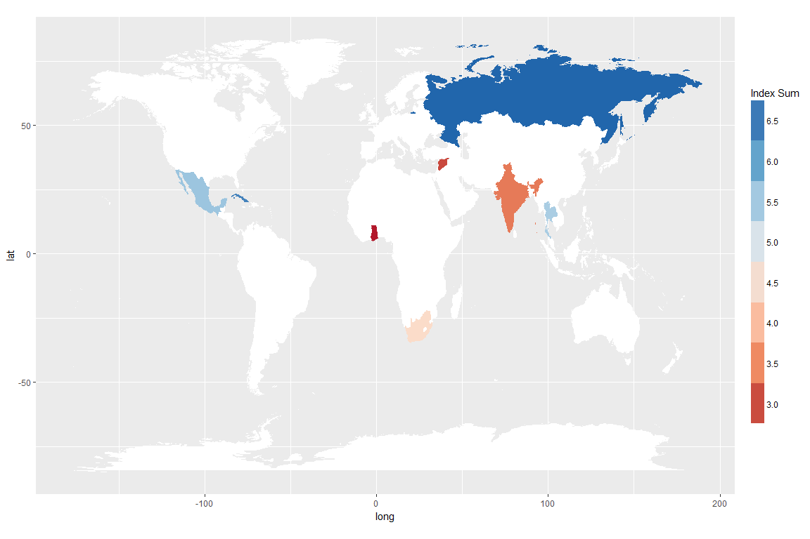

HW1
================
Team Syria

<style>
    body .main-container {
        max-width: 90%;
    }
</style>
``` r
library(googledrive)
library(tidyverse)
```

    ## Loading tidyverse: ggplot2
    ## Loading tidyverse: tibble
    ## Loading tidyverse: tidyr
    ## Loading tidyverse: readr
    ## Loading tidyverse: purrr
    ## Loading tidyverse: dplyr

    ## Conflicts with tidy packages ----------------------------------------------

    ## filter(): dplyr, stats
    ## lag():    dplyr, stats

``` r
library(readxl)
library(lubridate)
```

    ## 
    ## Attaching package: 'lubridate'

    ## The following object is masked from 'package:base':
    ## 
    ##     date

``` r
library(pander)
# library(ggmap)
library(scales)
```

    ## 
    ## Attaching package: 'scales'

    ## The following object is masked from 'package:purrr':
    ## 
    ##     discard

    ## The following object is masked from 'package:readr':
    ## 
    ##     col_factor

``` r
combo <- read_excel("~/Development-Economics/data/combo.xlsx")
```

``` r
normalize <- function(x){
  round((x - min(x)) / (max(x) - min(x)), digits = 2)
}
```

``` r
# weight_negatively <- function(x){
  # x <- x * -1
# }
```

``` r
combo_norm <- combo %>%
  mutate_if(is.numeric, funs(normalize))
```

``` r
Score <- combo_norm %>%
  group_by(Country) %>%
  summarise(sum = sum(`Improved water source (% of population with access)`,
                      `Life expectancy at birth, total (years)`,
                      `Urban population growth (annual %)`,
                      `Adult Literacy Rate (% Ages 15 and older)`,
                      `Population with at least some secondary education (% ages 25 and older)`,
                      `Mean years of schooling (years)`,
                      `Inequality in education (%)`,
                      `GNI per capita (2011 PPP$)`,
                      `Press Freedom Score (0 worst - 100 best)`)) %>%
  as.matrix() %>%
  t()

Score <- Score[-1,]
```

``` r
pander::panderOptions('table.split.table', Inf)

emphasize.strong.cols(which(combo_norm$Country == "Syria",
                            arr.ind = TRUE))

combo_norm_matr_trans <- combo_norm %>%
  as.matrix() %>%
  t() %>%
  na.omit() 

combo_matrix <- rbind(combo_norm_matr_trans, Score)

# emphasize.strong.rows(1)
emphasize.strong.rows(c(1, nrow(combo_matrix)))
```

``` r
pander(combo_matrix)
```

<table>
<colgroup>
<col width="23%" />
<col width="7%" />
<col width="8%" />
<col width="8%" />
<col width="9%" />
<col width="9%" />
<col width="13%" />
<col width="8%" />
<col width="10%" />
</colgroup>
<tbody>
<tr class="odd">
<td align="center"><strong>Country</strong></td>
<td align="center"><strong>Cuba</strong></td>
<td align="center"><strong>Ghana</strong></td>
<td align="center"><strong>India</strong></td>
<td align="center"><strong>Mexico</strong></td>
<td align="center"><strong>Russia</strong></td>
<td align="center"><strong>South Africa</strong></td>
<td align="center"><strong>Syria</strong></td>
<td align="center"><strong>Thailand</strong></td>
</tr>
<tr class="even">
<td align="center"><strong>Improved water source (% of population with access)</strong></td>
<td align="center">0.69</td>
<td align="center">0.00</td>
<td align="center">0.64</td>
<td align="center">0.83</td>
<td align="center">0.91</td>
<td align="center">0.51</td>
<td align="center"><strong>0.25</strong></td>
<td align="center">1.00</td>
</tr>
<tr class="odd">
<td align="center"><strong>Life expectancy at birth, total (years)</strong></td>
<td align="center">1.00</td>
<td align="center">0.06</td>
<td align="center">0.38</td>
<td align="center">0.85</td>
<td align="center">0.53</td>
<td align="center">0.00</td>
<td align="center"><strong>0.50</strong></td>
<td align="center">0.75</td>
</tr>
<tr class="even">
<td align="center"><strong>Urban population growth (annual %)</strong></td>
<td align="center">0.47</td>
<td align="center">1.00</td>
<td align="center">0.80</td>
<td align="center">0.69</td>
<td align="center">0.46</td>
<td align="center">0.80</td>
<td align="center"><strong>0.00</strong></td>
<td align="center">0.90</td>
</tr>
<tr class="odd">
<td align="center"><strong>Adult Literacy Rate (% Ages 15 and older)</strong></td>
<td align="center">1.00</td>
<td align="center">0.16</td>
<td align="center">0.00</td>
<td align="center">0.81</td>
<td align="center">1.00</td>
<td align="center">0.80</td>
<td align="center"><strong>0.52</strong></td>
<td align="center">0.89</td>
</tr>
<tr class="even">
<td align="center"><strong>Population with at least some secondary education (% ages 25 and older)</strong></td>
<td align="center">0.82</td>
<td align="center">0.38</td>
<td align="center">0.18</td>
<td align="center">0.33</td>
<td align="center">1.00</td>
<td align="center">0.65</td>
<td align="center"><strong>0.00</strong></td>
<td align="center">0.08</td>
</tr>
<tr class="odd">
<td align="center"><strong>Mean years of schooling (years)</strong></td>
<td align="center">0.97</td>
<td align="center">0.20</td>
<td align="center">0.08</td>
<td align="center">0.44</td>
<td align="center">1.00</td>
<td align="center">0.73</td>
<td align="center"><strong>0.00</strong></td>
<td align="center">0.36</td>
</tr>
<tr class="even">
<td align="center"><strong>Inequality in education (%)</strong></td>
<td align="center">0.23</td>
<td align="center">0.86</td>
<td align="center">1.00</td>
<td align="center">0.44</td>
<td align="center">0.00</td>
<td align="center">0.35</td>
<td align="center"><strong>0.73</strong></td>
<td align="center">0.35</td>
</tr>
<tr class="odd">
<td align="center"><strong>GNI per capita (2011 PPP$)</strong></td>
<td align="center">0.21</td>
<td align="center">0.03</td>
<td align="center">0.11</td>
<td align="center">0.63</td>
<td align="center">1.00</td>
<td align="center">0.44</td>
<td align="center"><strong>0.00</strong></td>
<td align="center">0.53</td>
</tr>
<tr class="even">
<td align="center"><strong>Press Freedom Score (0 worst - 100 best)</strong></td>
<td align="center">1.00</td>
<td align="center">0.00</td>
<td align="center">0.18</td>
<td align="center">0.53</td>
<td align="center">0.85</td>
<td align="center">0.08</td>
<td align="center"><strong>0.98</strong></td>
<td align="center">0.58</td>
</tr>
<tr class="odd">
<td align="center"><strong>Score</strong></td>
<td align="center"><strong>6.39</strong></td>
<td align="center"><strong>2.69</strong></td>
<td align="center"><strong>3.37</strong></td>
<td align="center"><strong>5.55</strong></td>
<td align="center"><strong>6.75</strong></td>
<td align="center"><strong>4.36</strong></td>
<td align="center"><strong>2.98</strong></td>
<td align="center"><strong>5.44</strong></td>
</tr>
</tbody>
</table>

``` r
map_world <- map_data(map = "world")
```

    ## 
    ## Attaching package: 'maps'

    ## The following object is masked from 'package:purrr':
    ## 
    ##     map

``` r
# Score <- combo_norm %>%
#   group_by(Country) %>%
#   summarise(sum = sum(`Improved water source (% of population with access)`,
#                       `Life expectancy at birth, total (years)`,
#                       `Urban population growth (annual %)`,
#                       `Adult Literacy Rate (% Ages 15 and older)`,
#                       `Population with at least some secondary education (% ages 25 and older)`,
#                       `Mean years of schooling (years)`,
#                       `Inequality in education (%)`,
#                       `GNI per capita (2011 PPP$)`,
#                       `Press Freedom Score (0 worst - 100 best)`))

index_countries <- combo_norm %>%
  group_by(Country) %>%
  summarise(`Index Sum` = sum(`Improved water source (% of population with access)`,
                    `Life expectancy at birth, total (years)`,
                    `Urban population growth (annual %)`,
                    `Adult Literacy Rate (% Ages 15 and older)`,
                    `Population with at least some secondary education (% ages 25 and older)`,
                    `Mean years of schooling (years)`,
                    `Inequality in education (%)`,
                    `GNI per capita (2011 PPP$)`,
                    `Press Freedom Score (0 worst - 100 best)`)) %>%
  inner_join(map_world, by = c("Country" = "region")) 

nonindex_countries <- map_world %>%
  anti_join(combo_norm, by = c("region" = "Country"))


index_map <- NULL
```

``` r
index_map <- ggplot() +
  geom_polygon(data = index_countries,
               aes(x = long, y = lat,
                   group = group,
                   # fill = total_map$`Press Freedom Score (0 worst - 100 best)`),
                   fill = `Index Sum`),  size = 0.01) +
  geom_polygon(data = nonindex_countries,
               aes(x = long, y = lat, group = group),
               # alpha = 0.1,
               fill = "white",
               size = 0.1) +
  coord_map() +
  scale_fill_distiller(type = "seq",
                       palette = "RdBu",
                       breaks = pretty_breaks(n=10), 
                       direction = 1) +
  coord_fixed(ratio = 1.5) +
  guides(fill = guide_legend(keywidth = 1, keyheight = 3, reverse = TRUE))
```

``` r
index_map
```


