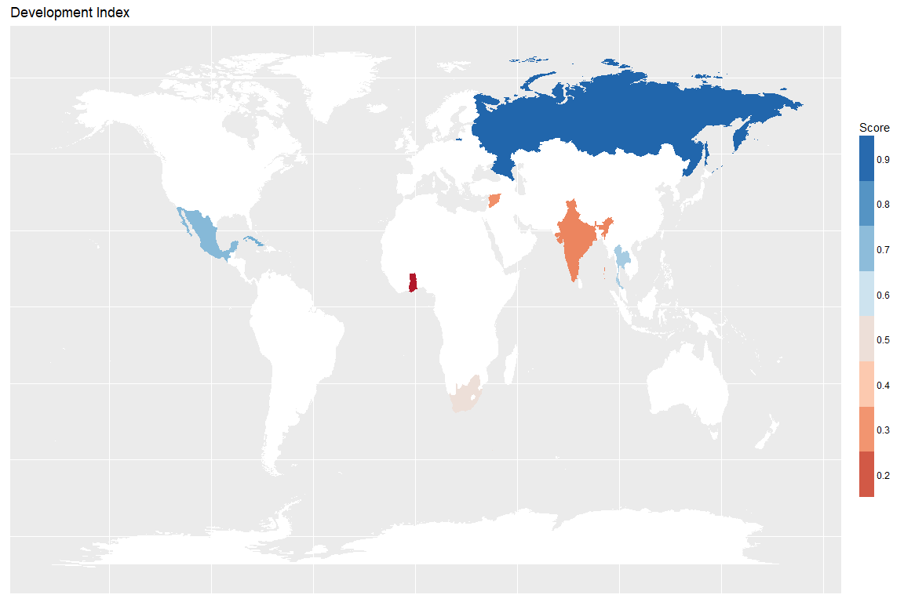

Constructing a Development Index
================
Brendan Knapp

-   [Data](#data)
    -   [Read and Inspect Raw Data](#read-and-inspect-raw-data)
    -   [Normalize](#normalize)
        -   [Normalize Formula](#normalize-formula)
    -   [Mutate](#mutate)
        -   [Combine Education Variables](#combine-education-variables)
    -   [Weight](#weight)
    -   [Score](#score)
    -   [Data Restructuring](#data-restructuring)
-   [Summary Table](#summary-table)
-   [Map](#map)

<!-- <style> -->
<!--     body .main-container { -->
<!--         max-width: 90%; -->
<!--     } -->
<!-- </style> -->
Environment Prep

``` r
# load packages
library(tidyverse)
library(readxl)
library(pander)
library(scales)
```

``` r
# set options so tables render nicely
pander::panderOptions('table.split.table', Inf)
```

Data
====

Data were retrieved from:

-   [World Bank Data](https://data.worldbank.org)
    -   Improved water source (% of population with access)
    -   Life expectancy at birth, total (years)
    -   Urban population growth (annual %)
-   [UNDP Human Development Reports](http://hdr.undp.org/en/data)
    -   Adult Literacy Rate (% Ages 15 and older)
    -   Population with at least some secondary education (% ages 25 and older)
    -   Mean years of schooling (years)
    -   Inequality in education (%)
    -   GNI per capita (2011 PPP$)

Read and Inspect Raw Data
-------------------------

We read the excel file containing our raw data and store it in a `data_frame` variable named `combo`.

``` r
combo <- read_excel("~/Development-Economics/data/combo.xlsx")

pander(combo)
```

<table>
<colgroup>
<col width="6%" />
<col width="12%" />
<col width="11%" />
<col width="8%" />
<col width="13%" />
<col width="13%" />
<col width="10%" />
<col width="11%" />
<col width="12%" />
</colgroup>
<thead>
<tr class="header">
<th align="center">Country</th>
<th align="center">Improved water source (% of population with access)</th>
<th align="center">Life expectancy at birth, total (years)</th>
<th align="center">Urban population %</th>
<th align="center">Adult Literacy Rate (% Ages 15 and older)</th>
<th align="center">Population with at least some secondary education (% ages 25 and older)</th>
<th align="center">Mean years of schooling (years)</th>
<th align="center">GNI per capita (2011 PPP$)</th>
<th align="center">Press Freedom Score (0 worst - 100 best)</th>
</tr>
</thead>
<tbody>
<tr class="odd">
<td align="center">Cuba</td>
<td align="center">94.6</td>
<td align="center">79.39</td>
<td align="center">77</td>
<td align="center">99.7</td>
<td align="center">84.8</td>
<td align="center">11.8</td>
<td align="center">7280</td>
<td align="center">90</td>
</tr>
<tr class="even">
<td align="center">Ghana</td>
<td align="center">87.6</td>
<td align="center">62.11</td>
<td align="center">55</td>
<td align="center">76.6</td>
<td align="center">59.8</td>
<td align="center">6.9</td>
<td align="center">3472</td>
<td align="center">28</td>
</tr>
<tr class="odd">
<td align="center">India</td>
<td align="center">94.1</td>
<td align="center">68.05</td>
<td align="center">33</td>
<td align="center">72.1</td>
<td align="center">48.7</td>
<td align="center">6.1</td>
<td align="center">5329</td>
<td align="center">39</td>
</tr>
<tr class="even">
<td align="center">Mexico</td>
<td align="center">96.1</td>
<td align="center">76.7</td>
<td align="center">80</td>
<td align="center">94.4</td>
<td align="center">57.4</td>
<td align="center">8.4</td>
<td align="center">16154</td>
<td align="center">61</td>
</tr>
<tr class="odd">
<td align="center">Russia</td>
<td align="center">96.9</td>
<td align="center">70.74</td>
<td align="center">74</td>
<td align="center">99.7</td>
<td align="center">94.6</td>
<td align="center">12</td>
<td align="center">24067</td>
<td align="center">81</td>
</tr>
<tr class="even">
<td align="center">South Africa</td>
<td align="center">92.8</td>
<td align="center">60.95</td>
<td align="center">65</td>
<td align="center">94.3</td>
<td align="center">74.9</td>
<td align="center">10.3</td>
<td align="center">12113</td>
<td align="center">33</td>
</tr>
<tr class="odd">
<td align="center">Syria</td>
<td align="center">90.1</td>
<td align="center">70.16</td>
<td align="center">58</td>
<td align="center">86.4</td>
<td align="center">38.9</td>
<td align="center">5.6</td>
<td align="center">2905</td>
<td align="center">89</td>
</tr>
<tr class="even">
<td align="center">Thailand</td>
<td align="center">97.8</td>
<td align="center">74.86</td>
<td align="center">52</td>
<td align="center">96.7</td>
<td align="center">43.3</td>
<td align="center">7.9</td>
<td align="center">14169</td>
<td align="center">64</td>
</tr>
</tbody>
</table>

Normalize
---------

### Normalize Formula

In order to normalize our values to a `0` to `1` scale, we use the following formula:

> Divide (cardinal number – minimum) by (maximum – minimum)

We create a function called `normalize` to achieve this result.

``` r
normalize <- function(x){
  (x - min(x)) / (max(x) - min(x))
}
```

Mutate
------

We take our `normalize()` function, apply it to our `combo` data, and store the results in a new `data_frame` called `combo_norm`. Since `Country` is a non-numeric column, `mutate_if` allows us to only apply our functions to columns where `is.numeric()` returns `TRUE`. We also rename our variables to simplify our table and drop any scale references.

``` r
combo_norm <- combo %>%
  mutate_if(is.numeric, funs(normalize)) %>%
  rename(`Press Freedom` = `Press Freedom Score (0 worst - 100 best)`,
         `Water Access` = `Improved water source (% of population with access)`,
         `Life Expectancy` = `Life expectancy at birth, total (years)`,
         `Urban Population` = `Urban population %`,
         `Adult Literacy` = `Adult Literacy Rate (% Ages 15 and older)`,
         `GNI per Capita` = `GNI per capita (2011 PPP$)`
         )

pander(combo_norm)
```

<table>
<colgroup>
<col width="8%" />
<col width="8%" />
<col width="10%" />
<col width="10%" />
<col width="9%" />
<col width="18%" />
<col width="14%" />
<col width="9%" />
<col width="9%" />
</colgroup>
<thead>
<tr class="header">
<th align="center">Country</th>
<th align="center">Water Access</th>
<th align="center">Life Expectancy</th>
<th align="center">Urban Population</th>
<th align="center">Adult Literacy</th>
<th align="center">Population with at least some secondary education (% ages 25 and older)</th>
<th align="center">Mean years of schooling (years)</th>
<th align="center">GNI per Capita</th>
<th align="center">Press Freedom</th>
</tr>
</thead>
<tbody>
<tr class="odd">
<td align="center">Cuba</td>
<td align="center">0.6863</td>
<td align="center">1</td>
<td align="center">0.9362</td>
<td align="center">1</td>
<td align="center">0.8241</td>
<td align="center">0.9688</td>
<td align="center">0.2067</td>
<td align="center">1</td>
</tr>
<tr class="even">
<td align="center">Ghana</td>
<td align="center">0</td>
<td align="center">0.06287</td>
<td align="center">0.4681</td>
<td align="center">0.163</td>
<td align="center">0.3752</td>
<td align="center">0.2031</td>
<td align="center">0.02679</td>
<td align="center">0</td>
</tr>
<tr class="odd">
<td align="center">India</td>
<td align="center">0.6373</td>
<td align="center">0.3849</td>
<td align="center">0</td>
<td align="center">0</td>
<td align="center">0.1759</td>
<td align="center">0.07812</td>
<td align="center">0.1145</td>
<td align="center">0.1774</td>
</tr>
<tr class="even">
<td align="center">Mexico</td>
<td align="center">0.8333</td>
<td align="center">0.8541</td>
<td align="center">1</td>
<td align="center">0.808</td>
<td align="center">0.3321</td>
<td align="center">0.4375</td>
<td align="center">0.6261</td>
<td align="center">0.5323</td>
</tr>
<tr class="odd">
<td align="center">Russia</td>
<td align="center">0.9118</td>
<td align="center">0.531</td>
<td align="center">0.8723</td>
<td align="center">1</td>
<td align="center">1</td>
<td align="center">1</td>
<td align="center">1</td>
<td align="center">0.8548</td>
</tr>
<tr class="even">
<td align="center">South Africa</td>
<td align="center">0.5098</td>
<td align="center">0</td>
<td align="center">0.6809</td>
<td align="center">0.8043</td>
<td align="center">0.6463</td>
<td align="center">0.7344</td>
<td align="center">0.4351</td>
<td align="center">0.08065</td>
</tr>
<tr class="odd">
<td align="center">Syria</td>
<td align="center">0.2451</td>
<td align="center">0.4995</td>
<td align="center">0.5319</td>
<td align="center">0.5181</td>
<td align="center">0</td>
<td align="center">0</td>
<td align="center">0</td>
<td align="center">0.9839</td>
</tr>
<tr class="even">
<td align="center">Thailand</td>
<td align="center">1</td>
<td align="center">0.7545</td>
<td align="center">0.4043</td>
<td align="center">0.8913</td>
<td align="center">0.07899</td>
<td align="center">0.3594</td>
<td align="center">0.5323</td>
<td align="center">0.5806</td>
</tr>
</tbody>
</table>

### Combine Education Variables

We decided to combine our education variables by taking their `mean` and assigning it to a new variable called `Combined Education`.

``` r
combo_norm_comb_ed <- combo_norm %>%
  group_by(Country) %>%
  mutate(`Combined Education` = mean(c(`Population with at least some secondary education (% ages 25 and older)`, `Mean years of schooling (years)`, `Adult Literacy`))) %>%
  select(-`Population with at least some secondary education (% ages 25 and older)`,
         -`Mean years of schooling (years)`,
         -`Adult Literacy`)

pander(combo_norm_comb_ed)
```

<table style="width:100%;">
<colgroup>
<col width="12%" />
<col width="12%" />
<col width="15%" />
<col width="15%" />
<col width="14%" />
<col width="13%" />
<col width="16%" />
</colgroup>
<thead>
<tr class="header">
<th align="center">Country</th>
<th align="center">Water Access</th>
<th align="center">Life Expectancy</th>
<th align="center">Urban Population</th>
<th align="center">GNI per Capita</th>
<th align="center">Press Freedom</th>
<th align="center">Combined Education</th>
</tr>
</thead>
<tbody>
<tr class="odd">
<td align="center">Cuba</td>
<td align="center">0.6863</td>
<td align="center">1</td>
<td align="center">0.9362</td>
<td align="center">0.2067</td>
<td align="center">1</td>
<td align="center">0.9309</td>
</tr>
<tr class="even">
<td align="center">Ghana</td>
<td align="center">0</td>
<td align="center">0.06287</td>
<td align="center">0.4681</td>
<td align="center">0.02679</td>
<td align="center">0</td>
<td align="center">0.2471</td>
</tr>
<tr class="odd">
<td align="center">India</td>
<td align="center">0.6373</td>
<td align="center">0.3849</td>
<td align="center">0</td>
<td align="center">0.1145</td>
<td align="center">0.1774</td>
<td align="center">0.08469</td>
</tr>
<tr class="even">
<td align="center">Mexico</td>
<td align="center">0.8333</td>
<td align="center">0.8541</td>
<td align="center">1</td>
<td align="center">0.6261</td>
<td align="center">0.5323</td>
<td align="center">0.5259</td>
</tr>
<tr class="odd">
<td align="center">Russia</td>
<td align="center">0.9118</td>
<td align="center">0.531</td>
<td align="center">0.8723</td>
<td align="center">1</td>
<td align="center">0.8548</td>
<td align="center">1</td>
</tr>
<tr class="even">
<td align="center">South Africa</td>
<td align="center">0.5098</td>
<td align="center">0</td>
<td align="center">0.6809</td>
<td align="center">0.4351</td>
<td align="center">0.08065</td>
<td align="center">0.7283</td>
</tr>
<tr class="odd">
<td align="center">Syria</td>
<td align="center">0.2451</td>
<td align="center">0.4995</td>
<td align="center">0.5319</td>
<td align="center">0</td>
<td align="center">0.9839</td>
<td align="center">0.1727</td>
</tr>
<tr class="even">
<td align="center">Thailand</td>
<td align="center">1</td>
<td align="center">0.7545</td>
<td align="center">0.4043</td>
<td align="center">0.5323</td>
<td align="center">0.5806</td>
<td align="center">0.4432</td>
</tr>
</tbody>
</table>

Weight
------

We decided on the following weighting scheme for our data: \* Water: 0.30 \* Education: 0.25 \* GNI per Capita: 0.18 \* Urban Population: 0.12 \* Press Freedom: 0.09 \* Life Expectancy: 0.06

We assign our weights to individual variables before using them. To ensure that we're weighting correctly, we also check that our weight `sum` to `1`.

``` r
water_wt <- 0.30
education_wt <- 0.25
GNI_wt <- 0.18
urban_wt <- 0.12
press_freedom_wt <- 0.09
life_expect_wt <- 0.06

weights <- c(water_wt, education_wt, GNI_wt, urban_wt, press_freedom_wt, life_expect_wt)

sum(weights) == 1
```

    ## [1] TRUE

In order to weight our data, we multiply each column by the appropriate weight variable. At this point, we also `round` our data to `2` digits following the decimal point.

``` r
combo_weighted <- combo_norm_comb_ed %>%
  mutate(`Water Access` = `Water Access` * water_wt,
         `Life Expectancy` = `Life Expectancy` * life_expect_wt,
         `Urban Population` = `Urban Population` * urban_wt,
         `GNI per Capita` = `GNI per Capita` * GNI_wt,
         `Press Freedom` = `Press Freedom` * press_freedom_wt,
         `Combined Education` = `Combined Education` * education_wt) %>%
  mutate_if(is.numeric, funs(round(., digits = 2)))

pander(combo_weighted)
```

<table style="width:100%;">
<colgroup>
<col width="12%" />
<col width="12%" />
<col width="15%" />
<col width="15%" />
<col width="14%" />
<col width="13%" />
<col width="16%" />
</colgroup>
<thead>
<tr class="header">
<th align="center">Country</th>
<th align="center">Water Access</th>
<th align="center">Life Expectancy</th>
<th align="center">Urban Population</th>
<th align="center">GNI per Capita</th>
<th align="center">Press Freedom</th>
<th align="center">Combined Education</th>
</tr>
</thead>
<tbody>
<tr class="odd">
<td align="center">Cuba</td>
<td align="center">0.21</td>
<td align="center">0.06</td>
<td align="center">0.11</td>
<td align="center">0.04</td>
<td align="center">0.09</td>
<td align="center">0.23</td>
</tr>
<tr class="even">
<td align="center">Ghana</td>
<td align="center">0</td>
<td align="center">0</td>
<td align="center">0.06</td>
<td align="center">0</td>
<td align="center">0</td>
<td align="center">0.06</td>
</tr>
<tr class="odd">
<td align="center">India</td>
<td align="center">0.19</td>
<td align="center">0.02</td>
<td align="center">0</td>
<td align="center">0.02</td>
<td align="center">0.02</td>
<td align="center">0.02</td>
</tr>
<tr class="even">
<td align="center">Mexico</td>
<td align="center">0.25</td>
<td align="center">0.05</td>
<td align="center">0.12</td>
<td align="center">0.11</td>
<td align="center">0.05</td>
<td align="center">0.13</td>
</tr>
<tr class="odd">
<td align="center">Russia</td>
<td align="center">0.27</td>
<td align="center">0.03</td>
<td align="center">0.1</td>
<td align="center">0.18</td>
<td align="center">0.08</td>
<td align="center">0.25</td>
</tr>
<tr class="even">
<td align="center">South Africa</td>
<td align="center">0.15</td>
<td align="center">0</td>
<td align="center">0.08</td>
<td align="center">0.08</td>
<td align="center">0.01</td>
<td align="center">0.18</td>
</tr>
<tr class="odd">
<td align="center">Syria</td>
<td align="center">0.07</td>
<td align="center">0.03</td>
<td align="center">0.06</td>
<td align="center">0</td>
<td align="center">0.09</td>
<td align="center">0.04</td>
</tr>
<tr class="even">
<td align="center">Thailand</td>
<td align="center">0.3</td>
<td align="center">0.05</td>
<td align="center">0.05</td>
<td align="center">0.1</td>
<td align="center">0.05</td>
<td align="center">0.11</td>
</tr>
</tbody>
</table>

Score
-----

By `sum`ming our normalized and weighted variables, we create our `Score` data. We also `round` these data to `2` digits following the decimal point.

``` r
Score <- combo_weighted %>%
  group_by(Country) %>%
  summarise(Score = sum(`Water Access`,
                        `Life Expectancy`,
                        `Urban Population`,
                        `GNI per Capita`,
                        `Press Freedom`,
                        `Combined Education`))

pander(Score)
```

<table style="width:31%;">
<colgroup>
<col width="20%" />
<col width="9%" />
</colgroup>
<thead>
<tr class="header">
<th align="center">Country</th>
<th align="center">Score</th>
</tr>
</thead>
<tbody>
<tr class="odd">
<td align="center">Cuba</td>
<td align="center">0.74</td>
</tr>
<tr class="even">
<td align="center">Ghana</td>
<td align="center">0.12</td>
</tr>
<tr class="odd">
<td align="center">India</td>
<td align="center">0.27</td>
</tr>
<tr class="even">
<td align="center">Mexico</td>
<td align="center">0.71</td>
</tr>
<tr class="odd">
<td align="center">Russia</td>
<td align="center">0.91</td>
</tr>
<tr class="even">
<td align="center">South Africa</td>
<td align="center">0.5</td>
</tr>
<tr class="odd">
<td align="center">Syria</td>
<td align="center">0.29</td>
</tr>
<tr class="even">
<td align="center">Thailand</td>
<td align="center">0.66</td>
</tr>
</tbody>
</table>

With our `Score` data, we can then create our `Rank` data.

``` r
Score_Rank <- Score %>%
  mutate(Rank = dense_rank(desc(Score)))

pander(Score_Rank)
```

<table style="width:43%;">
<colgroup>
<col width="20%" />
<col width="11%" />
<col width="11%" />
</colgroup>
<thead>
<tr class="header">
<th align="center">Country</th>
<th align="center">Score</th>
<th align="center">Rank</th>
</tr>
</thead>
<tbody>
<tr class="odd">
<td align="center">Cuba</td>
<td align="center">0.74</td>
<td align="center">2</td>
</tr>
<tr class="even">
<td align="center">Ghana</td>
<td align="center">0.12</td>
<td align="center">8</td>
</tr>
<tr class="odd">
<td align="center">India</td>
<td align="center">0.27</td>
<td align="center">7</td>
</tr>
<tr class="even">
<td align="center">Mexico</td>
<td align="center">0.71</td>
<td align="center">3</td>
</tr>
<tr class="odd">
<td align="center">Russia</td>
<td align="center">0.91</td>
<td align="center">1</td>
</tr>
<tr class="even">
<td align="center">South Africa</td>
<td align="center">0.5</td>
<td align="center">5</td>
</tr>
<tr class="odd">
<td align="center">Syria</td>
<td align="center">0.29</td>
<td align="center">6</td>
</tr>
<tr class="even">
<td align="center">Thailand</td>
<td align="center">0.66</td>
<td align="center">4</td>
</tr>
</tbody>
</table>

The example format that we have seen looks like so:


To match this we need to convert our `data_frame` to a `matrix`, transpose the data, and store it in a variable that we'll call `Score`.

``` r
Score_Rank <- Score_Rank %>%
  as.matrix() %>%
  t()

pander(Score_Rank)
```

<table>
<colgroup>
<col width="15%" />
<col width="7%" />
<col width="9%" />
<col width="9%" />
<col width="10%" />
<col width="10%" />
<col width="17%" />
<col width="9%" />
<col width="11%" />
</colgroup>
<tbody>
<tr class="odd">
<td align="center"><strong>Country</strong></td>
<td align="center">Cuba</td>
<td align="center">Ghana</td>
<td align="center">India</td>
<td align="center">Mexico</td>
<td align="center">Russia</td>
<td align="center">South Africa</td>
<td align="center">Syria</td>
<td align="center">Thailand</td>
</tr>
<tr class="even">
<td align="center"><strong>Score</strong></td>
<td align="center">0.74</td>
<td align="center">0.12</td>
<td align="center">0.27</td>
<td align="center">0.71</td>
<td align="center">0.91</td>
<td align="center">0.50</td>
<td align="center">0.29</td>
<td align="center">0.66</td>
</tr>
<tr class="odd">
<td align="center"><strong>Rank</strong></td>
<td align="center">2</td>
<td align="center">8</td>
<td align="center">7</td>
<td align="center">3</td>
<td align="center">1</td>
<td align="center">5</td>
<td align="center">6</td>
<td align="center">4</td>
</tr>
</tbody>
</table>

We're then going to detach the `Country` row so that we can bind the `Score` and `Rank` rows to our summary table.

``` r
Score_Rank <- Score_Rank[-1, ]

pander(Score_Rank)
```

<table style="width:94%;">
<colgroup>
<col width="16%" />
<col width="9%" />
<col width="9%" />
<col width="9%" />
<col width="9%" />
<col width="9%" />
<col width="9%" />
<col width="9%" />
<col width="9%" />
</colgroup>
<tbody>
<tr class="odd">
<td align="center"><strong>Score</strong></td>
<td align="center">0.74</td>
<td align="center">0.12</td>
<td align="center">0.27</td>
<td align="center">0.71</td>
<td align="center">0.91</td>
<td align="center">0.50</td>
<td align="center">0.29</td>
<td align="center">0.66</td>
</tr>
<tr class="even">
<td align="center"><strong>Rank</strong></td>
<td align="center">2</td>
<td align="center">8</td>
<td align="center">7</td>
<td align="center">3</td>
<td align="center">1</td>
<td align="center">5</td>
<td align="center">6</td>
<td align="center">4</td>
</tr>
</tbody>
</table>

Data Restructuring
------------------

To produce the desired table, we convert our `combo_norm` variable to a matrix, which we then transpose and store in a variable called `combo_norm_matr_trans`.

``` r
combo_norm_matr_trans <- combo_weighted %>%
  as.matrix() %>%
  t()

pander(combo_norm_matr_trans)
```

<table>
<colgroup>
<col width="25%" />
<col width="7%" />
<col width="8%" />
<col width="8%" />
<col width="9%" />
<col width="9%" />
<col width="15%" />
<col width="8%" />
<col width="10%" />
</colgroup>
<tbody>
<tr class="odd">
<td align="center"><strong>Country</strong></td>
<td align="center">Cuba</td>
<td align="center">Ghana</td>
<td align="center">India</td>
<td align="center">Mexico</td>
<td align="center">Russia</td>
<td align="center">South Africa</td>
<td align="center">Syria</td>
<td align="center">Thailand</td>
</tr>
<tr class="even">
<td align="center"><strong>Water Access</strong></td>
<td align="center">0.21</td>
<td align="center">0.00</td>
<td align="center">0.19</td>
<td align="center">0.25</td>
<td align="center">0.27</td>
<td align="center">0.15</td>
<td align="center">0.07</td>
<td align="center">0.30</td>
</tr>
<tr class="odd">
<td align="center"><strong>Life Expectancy</strong></td>
<td align="center">0.06</td>
<td align="center">0.00</td>
<td align="center">0.02</td>
<td align="center">0.05</td>
<td align="center">0.03</td>
<td align="center">0.00</td>
<td align="center">0.03</td>
<td align="center">0.05</td>
</tr>
<tr class="even">
<td align="center"><strong>Urban Population</strong></td>
<td align="center">0.11</td>
<td align="center">0.06</td>
<td align="center">0.00</td>
<td align="center">0.12</td>
<td align="center">0.10</td>
<td align="center">0.08</td>
<td align="center">0.06</td>
<td align="center">0.05</td>
</tr>
<tr class="odd">
<td align="center"><strong>GNI per Capita</strong></td>
<td align="center">0.04</td>
<td align="center">0.00</td>
<td align="center">0.02</td>
<td align="center">0.11</td>
<td align="center">0.18</td>
<td align="center">0.08</td>
<td align="center">0.00</td>
<td align="center">0.10</td>
</tr>
<tr class="even">
<td align="center"><strong>Press Freedom</strong></td>
<td align="center">0.09</td>
<td align="center">0.00</td>
<td align="center">0.02</td>
<td align="center">0.05</td>
<td align="center">0.08</td>
<td align="center">0.01</td>
<td align="center">0.09</td>
<td align="center">0.05</td>
</tr>
<tr class="odd">
<td align="center"><strong>Combined Education</strong></td>
<td align="center">0.23</td>
<td align="center">0.06</td>
<td align="center">0.02</td>
<td align="center">0.13</td>
<td align="center">0.25</td>
<td align="center">0.18</td>
<td align="center">0.04</td>
<td align="center">0.11</td>
</tr>
</tbody>
</table>

Next, we bind `Score_Rank` to `combo_norm_matr_trans` by row and store the result in a variable called `combo_matrix`.

``` r
combo_matrix <- rbind(combo_norm_matr_trans, Score_Rank)
```

Before viewing the result, we bold our `Score` and `Rank` rows and our `Syria` column.

``` r
emphasize.strong.rows(c(1, nrow(combo_matrix), nrow(combo_matrix) - 1))

emphasize.strong.cols(7)
```

Summary Table
=============

``` r
pander(combo_matrix)
```

<table>
<colgroup>
<col width="19%" />
<col width="8%" />
<col width="9%" />
<col width="9%" />
<col width="9%" />
<col width="9%" />
<col width="14%" />
<col width="9%" />
<col width="10%" />
</colgroup>
<tbody>
<tr class="odd">
<td align="center"><strong>Country</strong></td>
<td align="center"><strong>Cuba</strong></td>
<td align="center"><strong>Ghana</strong></td>
<td align="center"><strong>India</strong></td>
<td align="center"><strong>Mexico</strong></td>
<td align="center"><strong>Russia</strong></td>
<td align="center"><strong>South Africa</strong></td>
<td align="center"><strong>Syria</strong></td>
<td align="center"><strong>Thailand</strong></td>
</tr>
<tr class="even">
<td align="center"><strong>Water Access</strong></td>
<td align="center">0.21</td>
<td align="center">0.00</td>
<td align="center">0.19</td>
<td align="center">0.25</td>
<td align="center">0.27</td>
<td align="center">0.15</td>
<td align="center"><strong>0.07</strong></td>
<td align="center">0.30</td>
</tr>
<tr class="odd">
<td align="center"><strong>Life Expectancy</strong></td>
<td align="center">0.06</td>
<td align="center">0.00</td>
<td align="center">0.02</td>
<td align="center">0.05</td>
<td align="center">0.03</td>
<td align="center">0.00</td>
<td align="center"><strong>0.03</strong></td>
<td align="center">0.05</td>
</tr>
<tr class="even">
<td align="center"><strong>Urban Population</strong></td>
<td align="center">0.11</td>
<td align="center">0.06</td>
<td align="center">0.00</td>
<td align="center">0.12</td>
<td align="center">0.10</td>
<td align="center">0.08</td>
<td align="center"><strong>0.06</strong></td>
<td align="center">0.05</td>
</tr>
<tr class="odd">
<td align="center"><strong>GNI per Capita</strong></td>
<td align="center">0.04</td>
<td align="center">0.00</td>
<td align="center">0.02</td>
<td align="center">0.11</td>
<td align="center">0.18</td>
<td align="center">0.08</td>
<td align="center"><strong>0.00</strong></td>
<td align="center">0.10</td>
</tr>
<tr class="even">
<td align="center"><strong>Press Freedom</strong></td>
<td align="center">0.09</td>
<td align="center">0.00</td>
<td align="center">0.02</td>
<td align="center">0.05</td>
<td align="center">0.08</td>
<td align="center">0.01</td>
<td align="center"><strong>0.09</strong></td>
<td align="center">0.05</td>
</tr>
<tr class="odd">
<td align="center"><strong>Combined Education</strong></td>
<td align="center">0.23</td>
<td align="center">0.06</td>
<td align="center">0.02</td>
<td align="center">0.13</td>
<td align="center">0.25</td>
<td align="center">0.18</td>
<td align="center"><strong>0.04</strong></td>
<td align="center">0.11</td>
</tr>
<tr class="even">
<td align="center"><strong>Score</strong></td>
<td align="center"><strong>0.74</strong></td>
<td align="center"><strong>0.12</strong></td>
<td align="center"><strong>0.27</strong></td>
<td align="center"><strong>0.71</strong></td>
<td align="center"><strong>0.91</strong></td>
<td align="center"><strong>0.50</strong></td>
<td align="center"><strong>0.29</strong></td>
<td align="center"><strong>0.66</strong></td>
</tr>
<tr class="odd">
<td align="center"><strong>Rank</strong></td>
<td align="center"><strong>2</strong></td>
<td align="center"><strong>8</strong></td>
<td align="center"><strong>7</strong></td>
<td align="center"><strong>3</strong></td>
<td align="center"><strong>1</strong></td>
<td align="center"><strong>5</strong></td>
<td align="center"><strong>6</strong></td>
<td align="center"><strong>4</strong></td>
</tr>
</tbody>
</table>

Map
===

To faciliate understanding the data, we can visualize it with a map.

``` r
map_world <- map_data(map = "world")

index_countries <- Score %>%
  inner_join(map_world, by = c("Country" = "region"))

nonindex_countries <- map_world %>%
  anti_join(combo_norm, by = c("region" = "Country"))
```

``` r
index_map <- ggplot() +
  geom_polygon(data = index_countries,
               aes(x = long, y = lat,
                   group = group,
                   fill = Score),  size = 0.01) +
  geom_polygon(data = nonindex_countries,
               aes(x = long, y = lat, group = group),
               fill = "white",
               size = 0.1) +
  coord_map() +
  scale_fill_distiller(type = "seq",
                       palette = "RdBu",
                       breaks = pretty_breaks(n=10),
                       direction = 1) +
  coord_fixed(ratio = 1.5) +
  guides(fill = guide_legend(keywidth = 1, keyheight = 3, reverse = TRUE)) +
  ggtitle("Development Index") +
  theme(axis.title.x = element_blank(),
        axis.text.x = element_blank(),
        axis.ticks.x = element_blank(),
        axis.title.y = element_blank(),
        axis.text.y = element_blank(),
        axis.ticks.y = element_blank()
        )
```

``` r
index_map
```


